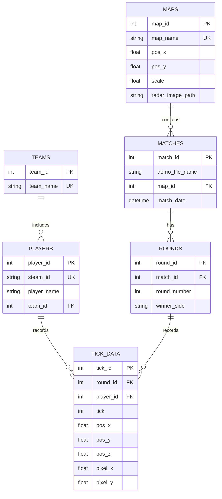

# CS2 Anti-Strat Tool

## Project Description

CS2 Anti-Strat is a Python web/data application that ingests Counter-Strike 2 demo files, extracts opening-round player positioning, stores normalized telemetry in SQLite, and visualizes map setups on radar overlays.

The codebase is organized as a layered architecture:

- API/UI layer (`src/antistrat/api`)
- Ingestion layer (`src/antistrat/ingestion`)
- Persistence layer (`src/antistrat/db`)
- Visualization layer (`src/antistrat/viz`)

Architecture rationale and stack decisions are documented in:

- `docs/architecture-decision-record.md`
- `docs/tech-stack-decision-record.md`

## Tech Stack

- Python 3.11+
- Poetry for dependency management
- Streamlit for UI
- demoparser2 for CS2 demo parsing
- SQLAlchemy + SQLite for persistence
- pandas/numpy for data processing
- matplotlib + Pillow for radar visualization
- pytest for tests
- ruff + pre-commit for formatting/linting gates

## How To Build

1. Install Poetry if needed.
2. Install dependencies:

```bash
poetry install
```

3. Install git hooks:

```bash
poetry run pre-commit install
```

## How To Run

Run Streamlit UI:

```bash
poetry run streamlit run src/antistrat/api/main.py
```

Then check Streamlit health endpoint:

```bash
curl http://localhost:8501/_stcore/health
```

## How To Run Tests

Run all tests:

```bash
poetry run pytest
```

Run by type:

```bash
poetry run pytest -m unit
poetry run pytest -m integration
poetry run pytest -m e2e
```

## Usage Examples

1. Open the Streamlit app.
2. Upload a `.dem` file in the sidebar.
3. Map is autodetected from demo metadata (optionally set a manual map override), then select parser filters (`CT`/`T`/`Both`, recurring players, opening window).
4. Click **Parse & Load Demo**.
5. Filter by demo, rounds, and player names to inspect setups.

## Logging and Error Monitoring

- Structured logging is configured in `src/antistrat/utils/logging_config.py`.
- Set log level with environment variable:

```bash
set LOG_LEVEL=DEBUG
```

- Optional Sentry integration for Streamlit app:

```bash
set SENTRY_DSN=<your_dsn>
set APP_ENV=development
```

## Database Schema

- ORM models: `src/antistrat/db/models.py`
- SQL schema export: `docs/schema.sql`

## Logical Data Design



Since SQLite is used, Dockerized dev/test database containers are not required for this project.

## Git and Pre-Commit Quality Gates

Configured in `.pre-commit-config.yaml`:

- formatter: `ruff format`
- linter: `ruff check`
- tests: `pytest`

Run manually:

```bash
poetry run pre-commit run --all-files
```

## GitHub Requirements Coverage

Repository includes:

- CI workflow: `.github/workflows/ci.yml`
- code security scanning: `.github/workflows/codeql.yml`
- Dependabot updates: `.github/dependabot.yml`
- process checklist (branch protection, feature branches, PR reviews): `docs/github-process-checklist.md`
- backlog and sprint plan: `docs/github-project-backlog.md`
- user stories and acceptance criteria per file: `docs/stories/`

## Deployment and Uptime Monitoring

### Docker Image

Build image:

```bash
docker build -t cs2-antistrat .
```

Run image:

```bash
docker run -p 8501:8501 cs2-antistrat
```

### Hosting

Deploy the Docker image to a third-party host (for example, Render Web Service) using the container runtime.

### Uptime Monitoring

Use any uptime monitor (for example, UptimeRobot, Better Stack, or Render health checks) to poll:

```text
GET /_stcore/health
```

and alert on non-200 responses.


